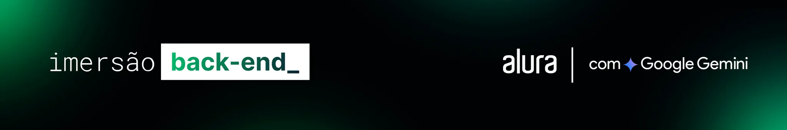

# Imersão Dev Back-end Alura 


Durante a Imersão Dev Back-end, nós mergulhamos no mundo das **APIs** e configuramos um **servidor local com Node.js**. Tudo isso com a ajuda do **Gemini**, a Inteligência Artificial do Google.

<p align="center" display: flex; justify-content: center; gap: 10px;>
    
    
    
</p>


## Tecnologias utilizadas no projeto 
- JavaScript 
- Node.js 
- Express 
- MongoDB 
- Google/generative-ai

## Para rodar o projeto 

**Back-end** 
```
    npm install 
    npm run dev
```

**Front-end** 
```
    npm install 
    npm run dev
```


