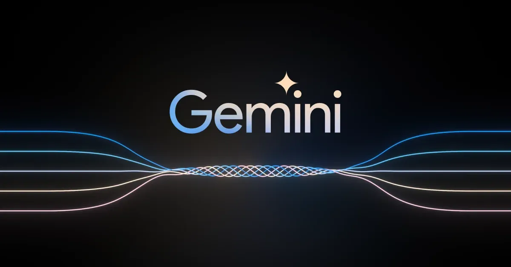
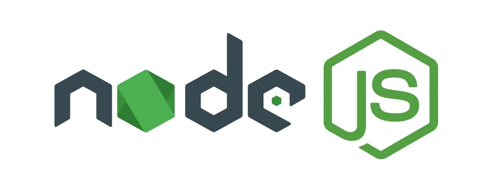

# Imersão Dev Back-end Alura 

Durante a Imersão Dev Back-end, vamos mergulhar no mundo das **APIs** e configurar seu primeiro **servidor local com Node.js**. Tudo isso com a ajuda do **Gemini**, a Inteligência Artificial do Google.

